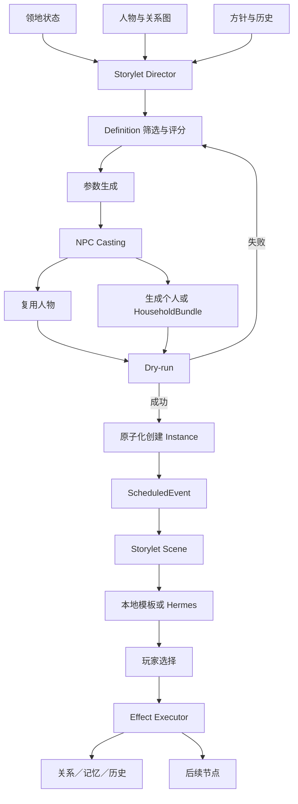

# Plan 020: Storylet 事件导演、NPC 选角与家庭生成框架

## 目标

在现有确定性领地系统、计划事件、人物账册、场景、历史和 Hermes 叙事层之间，增加完整的 Storylet 内容框架：

> 后端根据真实世界状态选择剧情模板，确定人物、地点、金额、选择和后果；Hermes 只把已经冻结的事实叙述成符合人物性格的中世纪故事。

框架闭环：

```text
领地状态／人物故事线
  -> 内容导演筛选 StoryletDefinition
  -> 参数生成与 NPC 选角
  -> dry-run
  -> 原子化提交 StoryEventInstance
  -> ScheduledEvent 到期并开启 Scene
  -> Hermes／本地模板叙述
  -> 玩家选择
  -> 后端规则结算
  -> 人物记忆、关系、历史和后续事件链
```

第一版使用“领民请求资助建设”作为垂直验收事件，但导演、选角和结算必须是通用框架，不能写死为贷款剧情。

## 核心原则

### LLM 不创造世界事实

LLM 不负责选择事件、创建人物、决定亲属、计算金额、增删选项或提交 `state_patch`。LLM 只接收冻结的 `cast`、`facts`、合法 `choices`、人物性格和有限历史，只输出 `narrative_md`。文本中的新姓名、金额、建筑或后果不得写入状态。

### Definition、Draft、Instance 分离

- `StoryletDefinition`：作者维护的只读模板。
- `StoryletDraft`：在 `deepcopy(state)` 上生成的候选，允许失败和丢弃。
- `StoryEventInstance`：dry-run 成功后原子化写入存档的冻结事实。

实例创建后，`definition_id`、`seed`、`cast`、`facts` 和 `choice_ids` 不允许由前端或 Hermes 修改。

### 人口统计不等于人物账册

- 100 名农奴仍是统计数据，不创建 100 个 NPC。
- 事件需要具体人物时优先复用已有 NPC。
- 无人符合时才从对应阶级 cohort 中具名化。
- 具名化不增加总人口或阶级人口。
- 只有死亡、出生、迁入、迁出等明确 effect 才改变人口统计。

### 两种导演入口

- 领地经营事件：事件优先，随后按角色槽位选角。
- 人物故事事件：人物优先，只筛选该人物可出演的 Storylet。

两种入口共用定义、dry-run、实例、结算和历史系统。

### 后果只能走正式服务

Storylet effect 不允许任意 JSON Patch。资源、建筑、人物、关系、外交、历史和计划事件变更必须使用白名单操作及正式 application service。同一选择要么全部成功，要么完全不写状态。

### Hermes 可选

导演、选角、人物生成、选择、结算和后续事件均为本地确定性功能。每个 Storylet 必须提供本地 Markdown 开场和结果 fallback；Hermes 不可用只降低文笔表现。

## 与现有系统的关系

本 Plan 建立在 Plan 002、005/005A、011、016、017、018、019 之上。

| 模块 | 原职责 | Storylet 接入 |
| --- | --- | --- |
| `scheduled_events` | 绝对时间、到期、重复、推进中断 | Storylet 的时间触发器 |
| `scenes` | 场景生命周期和参与者 | 绑定 `story_event_id` 和冻结 cast |
| `characters` | 人物组件、装备和记忆 | 社会身份、性格轴、家庭、生成来源 |
| `history` | 编年史和关联索引 | 记录起因、选择、结果和事件链 |
| `turn` | 九日战略结算 | 完整回合后调用一次导演 |
| Hermes | 叙事、对白、描述 | 只读叙述实例 |

现有 `event_templates` 继续负责时间调度。Storylet 使用独立数据目录，不把调度模板和剧情模板混成一个 schema。

## 非目标

第一版不实现：

- LLM 自由生成 StoryletDefinition。
- 一次编写几十或上百个事件。
- 给全部统计人口创建 NPC。
- 完整遗传、家谱、多代继承或私人地产系统。
- 自动生成无限对白树。
- 同时开放多个阻塞型主事件。
- `eval`、任意 Python 表达式或脚本化 effect。
- Storylet 绕过战略行动槽、建筑合法性或资源校验。

## 架构



## 生命周期

`StoryEventInstance` 状态：

```text
ready -> active -> awaiting_choice -> resolved
                    |                -> failed
                    -> cancelled
```

- `ready`：已创建并绑定尚未激活的计划事件。
- `active`：计划事件到期，场景开启。
- `awaiting_choice`：等待玩家选择。
- `resolved`：选择及后果成功提交。
- `cancelled`：因世界状态变化被取消。
- `failed`：正式激活后遇到不可恢复配置错误，必须暴露原因。

事件链使用稳定 `chain_id`。后续节点可绕过起始模板冷却，但不能重复当前节点；chain 保存完成节点、承诺、关键人物和冻结事实摘要。

## State Schema

```json
{
  "storylets": {
    "instances": [],
    "current_instance_id": null,
    "chains": {},
    "cooldowns": {},
    "recent_template_ids": [],
    "recent_cast": {},
    "next_instance_id": 1,
    "next_chain_id": 1,
    "director": {
      "enabled": true,
      "seed": 2001,
      "last_run_time": null,
      "last_decision": null,
      "major_events_this_turn": 0,
      "minor_events_this_turn": 0
    }
  },
  "character_relationships": {
    "edges": [],
    "next_id": 1
  },
  "households": {
    "entries": [],
    "next_id": 1
  }
}
```

兼容要求：

- `normalize_state()` 为旧存档补字段。
- normalize 不生成事件、人物、关系或家庭。
- 重复 normalize 不改变 id 或重复创建边。
- 旧人物新增组件使用安全默认值。
- 全部字段保持 JSON-compatible。

## StoryletDefinition

新增目录：

```text
backend/app/data/storylets/
  director.json
  character_generation.json
  wardrobe_templates.json
  petition_building_credit.json
```

每个文件可以包含一条事件链的多个节点，但 `definition_id + node_key` 必须全局唯一。

```json
{
  "schema_version": 1,
  "id": "petition_building_credit",
  "node_key": "petition",
  "category": "finance",
  "source_kind": "realm",
  "priority": "major",
  "base_weight": 20,
  "cooldown_days": 45,
  "blocking": true,
  "scene_type": "court",
  "triggers": {
    "population_class_any": ["serfs", "free_peasants", "artisans"],
    "minimum_class_population": 1,
    "directive_any": ["finance_commercial_growth", "status_quo_reserve"],
    "resource_minimum": {"gold": 50},
    "requires_legal_building_any": ["farm", "shop", "handicraft_workshop", "homes"]
  },
  "roles": {
    "petitioner": {
      "required": true,
      "distinct": true,
      "class_any": ["serfs", "free_peasants", "artisans"],
      "adult": true,
      "prefer_traits": ["ambitious", "family_oriented"],
      "reuse_existing": true,
      "generate_if_missing": true
    },
    "dependent": {
      "required": false,
      "distinct": true,
      "relation_to": "petitioner",
      "relation_any": ["child", "spouse"],
      "adult": true,
      "generate_relation_if_missing": true
    }
  },
  "parameters": {
    "building_id": {"from_trigger_result": "legal_buildings"},
    "tile": {"from_service": "legal_build_tiles"},
    "saved_gold_ratio": {"range": [0.3, 0.8]},
    "collateral_variant": {
      "weighted_values": {
        "harvest_share": 40,
        "extended_labor": 30,
        "household_service": 20,
        "land_use_right": 10
      }
    }
  },
  "choice_ids": [
    "grant_subsidy",
    "offer_loan",
    "demand_collateral",
    "joint_sponsorship",
    "refuse_petition",
    "confiscate_savings"
  ]
}
```

### 有限 DSL

触发器注册表：

```text
resource_minimum / resource_maximum
population_class_any / minimum_class_population
season_any / weather_any
directive_any / directive_domain_any
building_count_minimum
army_size_minimum / military_readiness_below
diplomacy_relation_below / at_war
character_hook_any / relationship_exists
history_tag_any / history_tag_none
requires_legal_building_any
chain_fact_equals
```

参数生成器注册表：

```text
constant
range
weighted_values
state_path_readonly
trigger_result
legal_build_tiles
character_component_readonly
chain_fact_readonly
```

不得支持 Python 路径导入、函数名字符串调用、shell 或代码执行。

## StoryEventInstance

```json
{
  "id": "story_evt_000031",
  "definition_id": "petition_building_credit",
  "node_key": "petition",
  "chain_id": "story_chain_000014",
  "seed": 483928,
  "status": "awaiting_choice",
  "priority": "major",
  "blocking": true,
  "created_time": {"calendar_day": 46, "clock_24": "06:00"},
  "activated_time": {"calendar_day": 46, "clock_24": "09:00"},
  "resolved_time": null,
  "scheduled_event_id": "evt_000044",
  "scene_id": "scene_17",
  "cast": {
    "petitioner": "char_18",
    "dependent": "char_27"
  },
  "cast_snapshots": {
    "petitioner": {"name": "奥托", "role": "佃农", "class_id": "serfs"},
    "dependent": {"name": "艾妲", "role": "家属", "class_id": "serfs"}
  },
  "facts": {
    "building_id": "farm",
    "tile": {"x": 4, "y": 7},
    "building_cost": {"gold": 50, "wood": 15},
    "saved_gold": 28,
    "requested_support": {"gold": 22, "wood": 15},
    "collateral_variant": "harvest_share"
  },
  "choice_ids": ["grant_subsidy", "offer_loan", "demand_collateral", "joint_sponsorship", "refuse_petition", "confiscate_savings"],
  "narrative_md": "",
  "selected_choice_id": null,
  "result": null,
  "followup_instance_ids": [],
  "version": 1
}
```

冻结规则：

- `cast`、`facts`、`choice_ids` 创建后只读。
- `cast_snapshots` 保证人物死亡、改名或离开后历史仍可解释。
- `narrative_md` 由本地模板初始化，可被一次成功的 Hermes 只读叙述替换。
- `selected_choice_id` 和 `result` 只能由后端 choose service 写入。
- 重复提交相同 choice 幂等；改选返回 `409`。

## 人物组件扩展

在 `COMPONENT_DEFAULTS` 增加：

```json
{
  "social_identity": {
    "class_id": "serfs",
    "legal_status": "bound_serf",
    "occupation_id": "tenant_farmer",
    "reputation": 12
  },
  "personality_axes": {
    "ambition": 72,
    "greed": 35,
    "boldness": 48,
    "loyalty": 60,
    "compassion": 55,
    "piety": 42,
    "deceit": 18
  },
  "household": {
    "household_id": "household_000014",
    "home_tile": "4:6",
    "member_ids": ["char_18", "char_27"],
    "dependent_ids": ["char_27"]
  },
  "narrative": {
    "goals": ["own_farm"],
    "hooks": ["family_debt"],
    "secrets": [],
    "recent_event_ids": ["story_evt_000031"],
    "active_chain_ids": ["story_chain_000014"]
  },
  "wardrobe": {
    "template_id": "serf_male_work_poor",
    "wealth_band": "poor",
    "season": "spring",
    "description_md": ""
  },
  "provenance": {
    "generator_version": 1,
    "seed": 88301,
    "archetype_id": "ambitious_family_provider",
    "created_by_story_event_id": "story_evt_000031",
    "population_origin": {
      "class_id": "serfs",
      "cohort_member": true,
      "materialized_by_event": "story_evt_000031"
    }
  }
}
```

所有 personality axis 为 `0..100`。数值是算法权威数据，`personality_md` 只是可读表现。普通衣着只影响描述，有玩法效果的物品才进入 inventory/equipment。

## 人口具名化

`materialize_character_from_cohort()` 必须：

1. 读取 `demographics.classes[class_id]` 的人口、年龄和性别结构。
2. 确认 cohort 尚有可具名化成员。
3. 按显式 seed 生成稳定的性别、成年年龄、财富带、职业、名字和 personality axes。
4. 创建 `population_origin.cohort_member=true` 的人物。
5. 不修改 `resources.population` 和阶级人口。
6. 记录 Storylet、seed 和 generator version。

```text
available_to_materialize = class_population - active_materialized_members
```

人物真正死亡或离开时，effect 同时更新人物状态和人口统计，并使用实例幂等键防止重复扣减。

## Household 和关系图

Household：

```json
{
  "id": "household_000014",
  "status": "active",
  "class_id": "serfs",
  "home_tile": "4:6",
  "member_ids": ["char_18", "char_27"],
  "head_character_id": "char_18",
  "wealth": 58,
  "created_by_story_event_id": "story_evt_000031"
}
```

Relationship Edge：

```json
{
  "id": "rel_000041",
  "from_character_id": "char_18",
  "to_character_id": "char_27",
  "type": "parent",
  "inverse_type": "child",
  "strength": 80,
  "status": "active",
  "started_time": {"calendar_day": 46, "clock_24": "06:00"},
  "ended_time": null,
  "source_story_event_id": "story_evt_000031",
  "metadata": {}
}
```

第一版关系类型：

```text
parent <-> child
spouse <-> spouse
sibling <-> sibling
employer <-> employee
debtor <-> creditor
guardian <-> ward
patron <-> client
rival <-> rival
friend <-> friend
```

约束：

- 两端人物必须存在且不能相同。
- `parent/child` 不能形成直接循环。
- 对称关系使用规范化唯一键，不能重复。
- 涉及未成年人的配偶、成人或性相关内容必须拒绝。
- 人物离开或死亡不删除历史边，只改为 inactive。

### HouseholdBundle 原子生成

1. 先寻找完整已有关系组合。
2. 找到主角但缺少关系角色时，可补全一名 cohort 合法成员。
3. 完全没有匹配时，在 draft 中生成整个 household。
4. dry-run 校验年龄差、人数、人口和关系合法性。
5. commit 时一次性创建人物、household 和关系边。
6. 任一步失败不留下半个人物或孤立关系。

## NPC Casting

```python
cast_storylet(
    state,
    definition,
    generated_facts,
    *,
    seed: int,
    focus_character_id: str | None = None,
) -> CastingDraft
```

选角顺序：

1. 对角色槽位依赖做拓扑排序。
2. 查找满足硬约束的现有人物。
3. 排除死亡、离开、互斥事件占用和重复冲突。
4. 评分并稳定排序。
5. 无候选时生成个人或 HouseholdBundle。
6. required roles 完成后做整体关系校验。

硬约束支持 `class_any`、`kind_any`、`occupation_any`、年龄、性别、势力、地点、状态、关系、hooks、`distinct` 和 `not_busy`。

评分权重放在 `character_generation.json`：

```text
阶级匹配                +30
职业匹配                +20
性格偏好                +15
已有关系／未完成故事线    +15
当前地点匹配             +10
复用已有持久人物          +10
最近频繁出场             -20
正在参与互斥事件          -50
```

相同输入和 seed 必须选出相同人物，禁止使用进程随机 hash 排序。

## Storylet Director

```python
select_storylet(
    state,
    *,
    source_kind: str,
    focus_character_id: str | None = None,
    seed: int,
) -> DirectorDecision | None
```

先淘汰 trigger 不满足、冷却中、达到最大次数、已有阻塞事件／议会、事件预算用尽、required roles 不完整、参数失败或 dry-run 失败的模板。

评分写入 `director.json`：

```text
总分 =
  状态紧迫度
  + 战略方针相关性
  + 未完成角色故事奖励
  + 历史连续性
  + 新颖性
  + 链条推进奖励
  - 模板重复惩罚
  - 人物近期出场惩罚
  - 类别连续重复惩罚
```

内容来源比例是软权重：40% 真实领地压力、25% 方针社会后果、20% 人物故事、10% 外交世界、5% 稀有意外。

频率：

- 每个完整九日回合最多 1 个 major。
- 每回合允许 0–2 条非阻塞 minor。
- 模板默认冷却 30–90 游戏日。
- 人物连续两次成为 major 主角后进入冷却。
- director 可以返回 `None`。
- 场景对话不会自动运行导演。

### Pipeline 接入

```text
收入
-> 唯一战略行动
-> 建设／军事／外交／人口／天气／支出／阈值事件
-> 时间推进
-> 方针进度与紧急议会
-> Storylet Director
-> 历史
```

被计划事件、议会或顾问选择打断时不运行导演。director 在完整回合结束后创建 `ready` 实例和到期时间为当前时刻的 scheduled event；下一次推进先激活 Storylet 并开场。director 不占用 Plan 019 的战略行动槽。

## Dry-run 和原子提交

```python
instantiate_storylet(
    state,
    definition_id,
    *,
    seed,
    focus_character_id=None,
    commit=False,
) -> StoryletDraft | StoryEventInstance
```

`commit=False`：

- 不创建人物、不增加 id。
- 不创建 scheduled event。
- 不写历史、人物记忆或请求审计。
- 不调用 Hermes。
- 不改变全局随机状态。

`commit=True` 在 detached state 上重复校验，一次性创建人物／家庭／关系、冻结实例、计划事件和占用记录，全部成功后才替换正式 state。

## Choice 和 Effect

Choice 示例：

```json
{
  "id": "offer_loan",
  "label": "按常例放贷",
  "description_md": "由领主补足缺口，未来从收成中偿还。",
  "requirements": {
    "resource_minimum_from_fact": "requested_support"
  },
  "effects": [
    {"op": "change_resources_from_fact", "fact": "requested_support", "multiplier": -1},
    {"op": "create_obligation", "kind": "building_loan", "debtor_role": "petitioner", "creditor": "player_lord"},
    {"op": "start_construction_from_facts", "building_fact": "building_id", "tile_fact": "tile"},
    {"op": "schedule_followup", "node_key": "loan_repayment_due", "in_days": 90},
    {"op": "append_character_memory", "role": "petitioner", "template_key": "loan_granted"}
  ]
}
```

Effect 白名单：

```text
change_resources / change_resources_from_fact
change_morale / change_authority
start_construction_from_facts
patch_character_component
append_character_memory
create_relationship / update_relationship
create_obligation / settle_obligation
set_character_hook / clear_character_hook
schedule_followup
append_history
emit_turn_event
```

每个 op 启动时校验 schema，执行时重新检查正式状态，只能读取实例的冻结 facts/cast，不能从客户端 payload 读取金额，不能调用 API 路由，多 effect 必须事务式执行。

建筑资助 MVP 不引入私人地产：

- 申请人积蓄与领主资助共同满足正式建筑成本。
- 建筑进入现有建设队列和经济循环。
- 人物获得债务／权益及 narrative hook。
- “共同持有”只记录 obligation，不改变建筑产出归属。
- 私人地产留给后续独立 Plan。

## 首个垂直事件链

### A：建设资助请愿

- 申请人：农奴、自由农或工匠。
- 建筑：农田、商店、手工作坊或村舍。
- 成本、工期、劳力和地块来自正式 catalog/service。
- 人物积蓄、资源缺口和抵押变体由后端冻结。

选择：

1. 无偿资助。
2. 正常贷款。
3. 要求合法抵押。
4. 共同资助并记录权益。
5. 拒绝。
6. 没收积蓄并惩罚申请人。

人物相关抵押只能使用明确成年且通过关系校验的人物；不得把未成年人放入成人、婚姻、性或身体抵押内容。默认优先收成、劳役、土地使用权和家庭服务等非性化方案。

### B：建筑完工

由正式 construction completion event 触发，引用相同 chain、申请人和建筑 facts，更新记忆、关系和债务，不重复建造。

### C：还款到期

使用绝对游戏日期，根据天气、完工状态、人物财富和领地状态确定偿还／延期／违约事实。金额和合法选择由后端决定。

### D：违约或提前偿还

违约可进入求情、逃离、追加劳役或没收权益；提前偿还提高信任和声望并关闭债务 hook。每条链必须有终止节点。

## Scene 集成

- scene type 来自定义。
- participants 由冻结 cast 生成。
- flags 包含 `source=storylet`、`story_event_id`、`story_chain_id`、`scheduled_event_id`、`facts_frozen=true`。
- 同时只能有一个 blocking Storylet scene。
- 未选择时通用结束场景不能解决实例。
- 选择成功后自动结束绑定 scene 并解决 scheduled event。
- 通用 `scene/end` 不得绕过必须选择的 blocking Storylet。

## 历史和记忆

major 实例激活、玩家选择、重要后续节点写历史，关联人物、地块、建筑、scheduled event 和 chain id。

人物记忆只保存简短事实和实例 id，不复制整篇叙事：

```text
第46日，领主批准了我的农田资助请求。 [story_evt_000031]
```

关系边、`narrative.recent_event_ids` 和 chain state 供导演保持连续性。

## Hermes 集成

新增专属 skill：

```text
lord-tail-storylet
```

runs API 增加只读模式：

```text
storylet_opening
storylet_result
```

规则：

- 只提供冻结 facts、cast snapshot、性格轴、有限记忆和合法 choice 文案。
- 不暴露资源 mutation、人物创建、关系修改或 choose tool。
- 最终输出只接受中文 Markdown。
- 姓名、金额、建筑和地块必须来自实例。
- 可增加感官描写、动作、语气和对白。
- 不得增加亲属、承诺、秘密、物品或后果。
- 人物说谎只能作为对白，不能覆盖 truth facts。
- 输出越界或失败时使用本地模板。

玩家选择由前端提交；Hermes 只有在玩家明确表达选择时才可调用正式 choose API，不得代替玩家决定。

## API

```text
GET  /api/storylets/current
GET  /api/storylets?status=&chain_id=&character_id=
GET  /api/storylets/{story_event_id}
GET  /api/storylets/{story_event_id}/choices
POST /api/storylets/{story_event_id}/choose
```

choose 请求只接受：

```json
{
  "choice_id": "offer_loan",
  "actor": "player"
}
```

人物关系与家庭：

```text
GET   /api/characters/{character_id}/relationships
POST  /api/state/characters/relationships
PATCH /api/state/characters/relationships/{relationship_id}
GET   /api/households
GET   /api/households/{household_id}
```

Debug：

```text
GET  /api/debug/storylets/definitions
POST /api/debug/storylets/preview
POST /api/debug/storylets/run-director
POST /api/debug/storylets/instantiate
```

preview 默认 `commit=false`，生产 UI 不调用 debug 路由。响应要展示被拒绝模板和原因。

## 前端

现有“事件”入口拆成：

1. 剧情事件：Storylet 实例和事件链。
2. 计划事件：商队、敌军、议会和绝对时间任务。

Storylet 侧拉框显示标题、时间、事件链、Markdown、人物卡片、公开冻结事实、合法选择和叙事来源。

交互要求：

- 重要或残酷选择二次确认。
- 请求只发送 `choice_id`。
- `409` 时重新读取实例。
- `422` 显示后端原因。
- 成功后展示结果 Markdown、资源变化和后续日期。
- blocking Storylet 未解决时明确禁用“推进九天”。

人物详情新增社会阶级、职业、Household、通用关系、personality axes、目标、hooks、故事链和最近事件；provenance 只在调试详情显示。

## 配置校验

启动时验证：

- schema version、definition id 和 node key 唯一。
- category、source kind、priority、scene type 合法。
- trigger、parameter generator、effect op 已注册。
- 阶级、建筑、资源、人物 kind 引用存在。
- role 依赖无循环，required role 有复用或生成路径。
- choice id 唯一且至少一个，每个 choice 有 fallback 文案。
- followup node 存在且每条链有终止节点。
- cooldown、权重、年龄、数量、时间范围安全。
- 不存在任意代码、未知 state 写路径或客户端控制 effect 参数。

配置错误时启动失败，并指出文件、JSON 路径和原因。

## 后端目录和修改范围

新增：

```text
backend/app/storylets/__init__.py
backend/app/storylets/config.py
backend/app/storylets/triggers.py
backend/app/storylets/parameters.py
backend/app/storylets/casting.py
backend/app/storylets/generation.py
backend/app/storylets/relationships.py
backend/app/storylets/director.py
backend/app/storylets/instances.py
backend/app/storylets/effects.py
backend/app/storylets/service.py
backend/app/api/storylets.py
backend/app/data/storylets/director.json
backend/app/data/storylets/character_generation.json
backend/app/data/storylets/wardrobe_templates.json
backend/app/data/storylets/petition_building_credit.json
```

修改：

- `systems/characters.py`：新增社会身份、性格轴、家庭、叙事和 provenance。
- `engine/state.py`：新增 storylets、relationships、households 和迁移。
- `engine/turn.py`：完整战略回合末调用 director。
- `systems/scheduled_events.py`：激活实例并用冻结 cast 开场。
- `engine/scenes.py`：防止通用结束绕过 choice。
- `engine/history.py`：记录重要 Storylet。
- `engine/hermes_context.py`：增加只读实例上下文和 skill routing。
- `api/runs.py`：增加 opening/result 只读模式。
- `api/schemas.py`：增加 choice、relationship 和 debug schema。
- `main.py`：启动校验并注册 router。
- `frontend/src/api.ts`、`App.tsx`：接入 Storylet、家庭和关系 UI。

建议前端组件：

```text
frontend/src/components/StoryletDrawer.tsx
frontend/src/components/StoryletChoiceCard.tsx
frontend/src/components/StoryChainTimeline.tsx
frontend/src/components/CharacterRelationships.tsx
```

## 实施阶段

### 阶段 1：状态、配置和关系骨架

- 增加 storylets、relationships、households 及 normalize。
- 增加人物社会组件。
- 实现配置加载、校验、关系图和 Household service。
- 保持旧人物 API 和旧存档兼容。

### 阶段 2：人物生成与 Casting

- 实现 cohort 可具名化数量。
- 确定性生成名字、年龄、性别、财富、职业、性格和衣着。
- 实现已有 NPC 优先评分、角色依赖和关系约束。
- 实现个人／HouseholdBundle 原子 draft。

### 阶段 3：实例、dry-run 和选择结算

- 实现 Definition -> Draft -> Instance。
- 实现 effect 注册表和事务式执行。
- 绑定 scheduled event、scene、history 和 memory。
- 实现读取／choose API、幂等和冲突。

### 阶段 4：建设资助垂直事件链

- 实现请愿、完工、还款、违约／偿还节点。
- 复用 catalog、建设服务和绝对日期。
- 覆盖三种阶级、四种建筑、六种选择及多种抵押。
- 验证后续节点稳定复用人物和 chain facts。

### 阶段 5：Director 和回合接入

- 实现 trigger、权重、冷却、预算和新颖性。
- 支持 realm-first 和 character-first。
- 接入回合末 director 和下一次推进中断。
- 增加 preview、拒绝原因和固定 seed 工具。

### 阶段 6：前端与 Hermes

- 完成 drawer、选择 UI、事件链和人物关系页。
- 增加 `lord-tail-storylet` skill。
- 增加 opening/result 只读叙事。
- 验证 Hermes 关闭时 fallback 可完整游玩。

### 阶段 7：框架回归和作者体验

- 提供 definition 模板、作者说明和校验 CLI。
- 固定 seed 批量生成至少 1000 个 draft。
- 运行至少 100 个战略回合，检查频率、重复率、复用率和存档增长。
- 新增第二个简单 Storylet，证明无需修改核心 director/casting/effect。

## 测试

新增至少：

```text
backend/tests/test_storylet_config.py
backend/tests/test_storylet_relationships.py
backend/tests/test_storylet_character_generation.py
backend/tests/test_storylet_casting.py
backend/tests/test_storylet_instances.py
backend/tests/test_storylet_effects.py
backend/tests/test_storylet_director.py
backend/tests/test_storylet_turn_integration.py
backend/tests/test_storylet_api.py
backend/tests/test_storylet_hermes_context.py
```

关键覆盖：

- 配置重复 id、未知操作、循环依赖和无终止节点时启动失败。
- cohort 具名化不改变人口且不超过可用人数。
- 相同 seed 生成相同人物和 draft。
- 优先复用已有 NPC，distinct role 不重复选人。
- HouseholdBundle 失败不留下部分人物。
- dry-run 对 state 零副作用。
- 实例 facts/cast 冻结，只创建一个 scheduled event。
- 客户端不能篡改金额、人物和地块。
- 多 effect 失败整体回滚。
- 相同 choice 重复提交幂等，改选返回 `409`。
- construction service 不会免费建造。
- 完整回合最多一个 major，被中断回合不运行导演。
- 模板／人物冷却、方针相关性和 character-first focus 生效。
- awaiting choice 的 scene 不能被通用 end 绕过。
- 选择后 scene 和 scheduled event 一并解决。
- Hermes 上下文只有冻结 facts 和合法 choice。
- Hermes 不可用时 fallback 可完成全流程。
- 前端只发送 choice id，build 通过。

## 调试和模拟工具

```text
tools/validate_storylets.py
tools/run_storylet_generation_matrix.py
tools/run_storylet_long_simulation.py
```

生成矩阵输出 definition、seed、trigger 拒绝原因、cast 来源、facts、dry-run 和 choice 合法性。

长局模拟输出：

- 每 100 天 major/minor 数量和类别比例。
- 模板重复间隔。
- NPC 复用率、新生成人数和连续出场次数。
- active chain 数和平均链长。
- 人物、关系、家庭、实例的存档增长。
- director/casting 平均和最大耗时。
- 配置错误、非法 choice 和事务回滚次数。

## 验证命令

```bash
cd /Users/ray/raylab/lord-tail
PYTHONPATH=backend backend/.venv/bin/python -m pytest backend/tests
PYTHONPATH=backend backend/.venv/bin/python -m compileall -q backend tools
npm --prefix frontend run build
PYTHONPATH=backend backend/.venv/bin/python tools/validate_storylets.py
PYTHONPATH=backend backend/.venv/bin/python tools/run_storylet_generation_matrix.py --definition petition_building_credit --seeds 100
PYTHONPATH=backend backend/.venv/bin/python tools/run_storylet_long_simulation.py --turns 100 --seed 2001
```

## 完成判定

- Definition、Draft 和 Instance 边界明确。
- 事实、选角、选择和后果全部由后端确定。
- LLM 只叙述冻结事实，Hermes 关闭后仍可玩。
- 优先复用人物，必要时可从 cohort 合法具名化。
- 具名化不增加人口，也不超过 cohort 人数。
- 支持原子家庭生成和通用关系。
- dry-run 对正式 state 零副作用。
- 玩家只能提交后端提供的 choice id。
- effect 通过白名单 service 事务式执行。
- 每回合最多一个 major，冷却和出场惩罚有效。
- realm-first 和 character-first 均可工作。
- blocking Storylet 正确中断下一次推进。
- 场景、历史、记忆和后续链保持同一 cast/facts。
- “建设资助请愿”完成请愿、选择、建设、到期和结束闭环。
- 新增第二个 Storylet 只增加配置和文案，不修改核心代码。
- 旧存档、人物 API、计划事件、议会和管理 AI 不回归。
- 测试、配置校验、长期模拟和前端构建全部通过。
