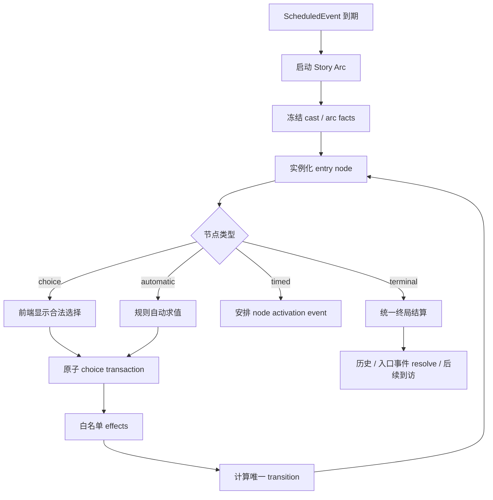
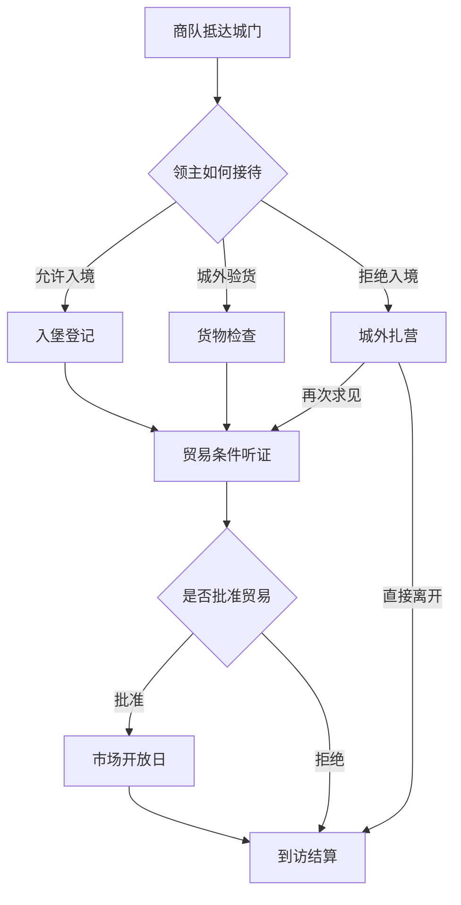

# Plan 021: 预编剧情图运行时与春季商队事件重构

## 目标

把现有 Storylet Chain 从“选择后用 `schedule_followup` 隐式串联节点”升级为可验证、可保存、可遍历的：

> **Scripted Story Arc Graph（预编剧情图运行时）**

优先将“春季末商队到访”改写为 5–8 个明确子事件组成的有向无环图。剧情的入口、当前节点、合法分支、条件、收束点和终局均由后端确定性规则管理；Hermes 只负责根据冻结事实演出当前节点，不能自行判断剧情是否已经进入下一幕或结束。

目标闭环：

```text
ScheduledEvent 到期
  -> 启动指定 Story Arc Definition
  -> 冻结整条剧情的 cast / 初始 facts
  -> 激活 entry_node 的 Storylet Instance + Scene
  -> Hermes 或本地模板演出当前节点
  -> 玩家选择结构化 choice（自由输入不能直接迁移节点）
  -> 后端原子执行 effects + transition
  -> 激活、定时或自动处理下一个节点
  -> 分支在显式收束节点汇合
  -> terminal 统一结算入口事件、历史及下一次到访
```

## 要解决的问题

当前普通 `caravan_arrival` 到期后只是创建一个 generic `caravan` scene，后续进度依赖玩家与 Hermes 自由对话：

- 商队人物、货物、诉求和结束条件没有在入口冻结。
- `scene_step` 只记录文本，不知道完成了哪个子事件。
- Hermes 自行决定何时调用 `resolve_event`，结果不稳定。
- `end_scene()` 与 `scheduled_event.resolve_event()` 没有事务绑定，可能出现 scene 已结束而计划事件永久停在 `active`。
- seasonal repeat 只在计划事件成功 resolve 后创建；漏掉 resolve 会造成下一季商队消失。
- `force_end_scene=true` 可以绕过剧情未完成状态。
- 现有 `schedule_followup` 把边藏在 choice effect 里，无法静态证明所有路径都能结束。
- 前端虽然可自由输入，但缺少权威的“当前节点”和始终可用的合法选择，容易拖成无限对话。

本 Plan 不通过增加 prompt 或让 LLM 更主动来修补这些问题，而是把剧情推进权收回确定性后端。

## 核心边界

| 系统 | 唯一职责 |
|---|---|
| `scheduled_events` | 绝对日期与时间、到期、取消、改期、入口 occurrence 去重 |
| Story Arc Graph | 当前节点、条件分支、分支收束、终局是否合法 |
| Storylet Instance | 当前节点冻结的 cast、facts、选项、模板与结算结果 |
| Scene | 当前节点内的对白、动作表现和有限自由交互 |
| Effects | 通过白名单服务提交资源、关系、人物、建筑、外交等后果 |
| Hermes | 当前节点的气氛、对白、动作和 Markdown 文案 |

强制原则：

1. LLM 不选择 transition，不设置 `current_node_id`，不直接 resolve authored arc。
2. 所有关键剧情推进都必须提交稳定 `choice_id`。
3. 自由文本可以用于询问或表演，但不能让 Hermes 猜测它等于哪一条边。
4. 一个节点的选择、effects、旧节点关闭和下一节点创建必须在一次原子事务中完成。
5. schema v2 第一版只允许 DAG，不允许循环；以后若引入循环必须显式配置 `max_visits`。
6. JSON 不得配置 Python 函数路径、表达式、shell、`eval` 或任意状态 patch。

## 非目标

第一版不实现：

- 通用 Quest/JRPG 任务系统。
- LLM 动态生成图、节点、choice 或后果。
- 任意脚本语言、Python 表达式或 JSON Patch。
- 多条阻塞型 Story Arc 同时占用主场景。
- 无限讨价还价循环。
- 可视化拖拽式剧情编辑器。
- 把全部旧 Storylet 强制一次性迁移到 schema v2。
- 让自由输入取代结构化选择按钮。

## 依赖与兼容关系

本 Plan 建立在 Plan 011、016、017、018、020 之上。

- 保留现有 `StoryEventInstance`、casting、人物具名化、关系、历史和 effect executor。
- 保留 `GET /api/storylets*` 与 `POST /api/storylets/{instance_id}/choose`，schema v2 的 choice 继续使用该入口，避免前端和 Hermes 出现第二套选择 API。
- schema v1 definition 继续按旧逻辑工作；只对 `schema_version: 2` 启用图验证和图运行时。
- 旧 `schedule_followup` 仅作为 schema v1 兼容操作保留，schema v2 validation 必须拒绝它。
- `scheduled_events` 继续是绝对时间的唯一来源；Story Arc 不自行维护另一套日历。

## 总体架构



新增模块建议：

```text
backend/app/storylets/graph.py       # schema v2 加载后的静态校验与可达性分析
backend/app/storylets/runtime.py     # arc 创建、节点激活、迁移和 terminal 结算
backend/app/data/storylets/spring_caravan_visit.json
backend/tests/test_story_arc_graph.py
backend/tests/test_spring_caravan_arc.py
.docs/story_arc_authoring.md
```

现有模块继续负责：

```text
config.py       definition 加载和基础字段校验
service.py      v1 兼容入口、实例公开结构和 API application service
instances.py    instance 查询与公开投影
effects.py      白名单 effect 调度
casting.py      角色选择与生成
parameters.py   冻结参数
triggers.py     世界状态条件
```

## Definition Schema v2

每个 authored arc 一个 JSON 文件。顶层是图，而不是独立 node 数组：

```json
{
  "schema_version": 2,
  "id": "spring_caravan_visit",
  "version": 1,
  "title": "春季末商队到访",
  "selection_mode": "scheduled",
  "entry_node": "arrival_gate",
  "roles": {
    "caravan_master": {
      "kind_any": ["merchant"],
      "adult": true,
      "reuse_existing": true,
      "generate_if_missing": true
    },
    "guard_captain": {
      "kind_any": ["soldier", "knight"],
      "optional": true,
      "reuse_existing": true,
      "generate_if_missing": false
    }
  },
  "parameters": {},
  "interaction_budget": {
    "default_max_freeform_steps": 2,
    "choices_visible_immediately": true
  },
  "nodes": {
    "arrival_gate": {
      "kind": "choice",
      "scene_type": "caravan",
      "blocking": true,
      "narrative_template_md": "商队在泥泞的城门外停下……",
      "choices": [
        {
          "id": "admit_inside",
          "label": "允许入堡登记",
          "description_md": "让商队进入外堡，在卫兵看守下登记人员和货物。",
          "effects": [
            {"op": "set_arc_fact", "key": "entry_policy", "value": "admitted"}
          ],
          "transition": {"to": "registration"}
        }
      ]
    },
    "visit_resolved": {
      "kind": "terminal",
      "scene_type": "caravan",
      "blocking": false,
      "narrative_template_md": "商队的账目与领主的裁断一并落入书记官卷宗。",
      "effects": [
        {"op": "resolve_entry_event"},
        {"op": "schedule_series_occurrence"},
        {"op": "append_history"}
      ]
    }
  }
}
```

### 节点类型

第一版只实现四种：

| `kind` | 行为 | 是否需要玩家 choice |
|---|---|---|
| `choice` | 展示稳定选择，等待明确 `choice_id` | 是 |
| `automatic` | 根据冻结事实和白名单条件选择唯一边 | 否 |
| `timed` | 使用计划事件在几小时/几天后激活目标节点 | 否 |
| `terminal` | 执行终局 effects，关闭 arc 与入口计划事件 | 否 |

约束：

- `choice` 至少一个 choice，每个 choice 必须有且仅有一个合法 transition。
- `automatic` 必须提供互斥的条件边及一个 fallback，否则 validation 失败。
- `timed` 必须提供 `after_hours` 或 `after_days`，且目标节点存在。
- `terminal` 不允许 transition，必须包含 `resolve_entry_event`。
- 第一版任何边都不能回到已在当前路径中的祖先节点。

### Transition Schema

```json
{
  "to": "trade_hearing",
  "when": {
    "fact_equals": {"contraband_found": true}
  },
  "after_hours": 0,
  "carry_facts": ["entry_policy", "contraband_found"]
}
```

`to` 必须引用同一 definition 的 node id。`after_hours` / `after_days` 只能用于显式延时；零延时节点由 runtime 同步激活。

### 条件注册表

第一版仅支持：

```text
fact_equals
fact_gte
fact_lte
choice_was
resource_minimum
relationship_minimum
character_trait_minimum
season_any
```

条件读取范围必须是冻结 arc facts、合法只读 state 或正式人物/关系服务。多个条件默认 `AND`；如需 `OR`，使用显式 `any` 数组，不解析表达式字符串。

### Effect 注册表增量

继续复用 `effects.py` 的正式 service 调用，新增：

```text
set_arc_fact
increment_arc_fact
resolve_entry_event
schedule_series_occurrence
```

`transition_to` 不作为 authored effect；迁移目标只能来自 definition 的 `transition`，避免 effect 与边出现两个真相来源。

`resolve_arc` 由 runtime 执行 terminal 时内部完成，不允许普通 choice 任意调用。

## 图静态校验

`backend/app/storylets/graph.py` 在配置加载和测试时执行：

1. 校验 `schema_version == 2`、稳定 `id`、正整数 `version` 和 `entry_node`。
2. 校验 node id 非空且唯一，所有 transition 目标存在。
3. 从 `entry_node` 深度遍历，拒绝孤立节点。
4. 检测环；第一版发现任何环直接失败。
5. 每条可达路径必须能到达至少一个 `terminal`。
6. 拒绝没有 fallback 的非完备 `automatic` 节点。
7. 检查每条路径的 blocking choice 数量；春季商队最多 3 个关键 decision。
8. 检查 `choice.id` 在节点内唯一，transition 唯一，effect op 在白名单内。
9. 检查 `scene_type`、资源、建筑、阶级和人物 kind 引用正式 catalog/registry。
10. 检查每个可见 node 和 choice 都有本地 Markdown fallback。
11. schema v2 禁止 `schedule_followup` 和 authored `transition_to` effect。

提供可复用分析结果：

```python
GraphAnalysis(
    reachable_nodes=set(...),
    terminal_nodes=set(...),
    paths=[...],
    max_blocking_decisions=3,
)
```

配置错误必须在应用启动或专用校验命令中明确指出文件、node、choice 和字段路径，不能等到游戏进行到第 90 日才报错。

## 运行时 State Schema

扩展现有 `storylets.chains[chain_id]`：

```json
{
  "id": "story_chain_000012",
  "definition_id": "spring_caravan_visit",
  "definition_version": 1,
  "status": "active",
  "current_node_id": "trade_hearing",
  "current_instance_id": "story_evt_000045",
  "entry_scheduled_event_id": "evt_000016",
  "series_id": "southern_caravan_route",
  "occurrence_key": "caravan:southern_route:year_1:spring",
  "cast": {"caravan_master": "char_31"},
  "cast_snapshots": {},
  "facts": {
    "entry_policy": "inspection",
    "contraband_found": true,
    "merchant_attitude": -15
  },
  "visited_nodes": ["arrival_gate", "cargo_inspection", "trade_hearing"],
  "node_results": {},
  "transition_seq": 3,
  "pending_node_event_id": null,
  "started_time": {"calendar_day": 90, "clock_24": "16:00"},
  "resolved_time": null
}
```

状态约束：

- `current_node_id`、`current_instance_id` 和当前 scene 的 `story_arc_*` flags 必须相互一致。
- 每个 node 激活时创建一个独立 `StoryEventInstance`，冻结当时可见 variants、choices 和 node facts。
- `visited_nodes` 按迁移顺序追加，不做 set 排序。
- `node_results[node_id]` 保存 choice、effects 摘要、迁移时间和目标节点。
- `transition_seq` 每次成功迁移加一，用于幂等键和并发冲突检测。
- `entry_scheduled_event_id` 从入口到 terminal 始终不变。
- `occurrence_key` 在 state 内唯一，重复激活同一季同一路线必须返回已有 chain。

### 旧存档 normalize

- `normalize_storylet_state()` 只补安全默认字段，不自动推进节点、不生成 NPC、不创建事件。
- schema v1 chain 标记 `runtime_version: 1`，继续旧逻辑。
- schema v2 chain 标记 `runtime_version: 2`。
- 新开局将默认春季商队绑定到 `spring_caravan_visit`。
- 已经处于 `active` 的旧 generic 商队不在 normalize 时偷偷改写；提供显式迁移函数或让其按旧方式结束，避免载入存档时改变剧情事实。

## 原子节点迁移

新增 `backend/app/storylets/runtime.py`，公开最少接口：

```python
start_arc_from_scheduled_event(state, definition_id, event_id, seed)
activate_current_node(state, chain_id)
choose_arc_node(state, chain_id, instance_id, choice_id, expected_transition_seq, actor)
run_automatic_nodes(state, chain_id, max_steps=16)
activate_timed_node(state, node_event_id)
resolve_arc(state, chain_id, actor)
```

一次 choice transaction：

```text
deepcopy(state)
  -> 验证 chain active、instance/current node 一致
  -> 验证 expected_transition_seq，阻止旧页面重复提交
  -> 验证 choice 属于当前冻结 instance
  -> 执行白名单 effects
  -> 写 node_results 和 visited_nodes
  -> 计算 definition 中唯一 transition
  -> 关闭旧 scene、node instance 和 node scheduled event
  -> 激活/安排目标 node
  -> 连续处理有限 automatic 节点
  -> terminal 时统一 resolve
全部成功后 state.clear()/state.update(detached)
```

任一步失败时原 state 不变。错误响应必须区分：

- `409 stale_transition_seq`
- `409 node_not_current`
- `409 arc_already_resolved`
- `422 invalid_choice`
- `422 no_transition`
- `500 invalid_authored_graph`（启动校验正常时不应出现）

重复提交同一 `instance_id + choice_id + transition_seq` 返回原结果并标记 `idempotent: true`；对同一节点提交不同 choice 返回 409。

## Scene 与计划事件一致性

### Scene flags

schema v2 node scene 必须带：

```json
{
  "source": "story_arc",
  "story_arc_chain_id": "story_chain_000012",
  "story_arc_definition_id": "spring_caravan_visit",
  "story_arc_node_id": "arrival_gate",
  "story_event_id": "story_evt_000045",
  "entry_scheduled_event_id": "evt_000016",
  "blocking": true
}
```

### 禁止绕过

- `scenes.end_scene()` 遇到 active schema v2 authored arc 时，除 runtime 内部携带的受控完成标志外必须返回 409。
- `POST /api/game/strategic-turn` 的 `force_end_scene=true` 不得关闭 authored arc scene。
- 普通 `POST /api/state/events/{entry_event_id}/resolve` 不得直接解决仍为 active 的 authored arc；必须走 terminal runtime。
- 如果 scene、instance、chain 或入口 scheduled event 任一方状态不一致，返回可诊断错误并保留状态，不做部分修复。
- terminal transaction 必须同时完成：当前 node、scene、chain、入口 scheduled event、history 和下一 occurrence 安排。

## Timed 子事件

`timed` node 不建立第二套时间系统。runtime 创建普通 ScheduledEvent：

```json
{
  "type": "story_arc_node",
  "flags": {
    "story_arc_chain_id": "story_chain_000012",
    "story_arc_node_id": "camp_outside"
  }
}
```

要求：

- 到期后由 `scheduled_events.activate_due_events()` 调用 `activate_timed_node()`。
- `pending_node_event_id` 防止重复安排。
- 当前有其他阻塞场景时节点保持 queued，不能丢失；场景释放后自动激活最早的 queued authored node。
- 玩家保存、读取或重启后，仍按绝对日期和 `clock_24` 继续。

## 春季商队剧情图

新增：

```text
backend/app/data/storylets/spring_caravan_visit.json
```

第一版采用以下 DAG：



建议节点：

| node id | kind | blocking | 作用 |
|---|---|---:|---|
| `arrival_gate` | `choice` | 是 | 冻结商队人物、路线、货物和初始态度；第一次分支 |
| `registration` | `automatic` | 否 | 记录友好入境、人员和车队信息 |
| `cargo_inspection` | `choice` | 是 | 决定检查强度，并由冻结 seed 确定违禁品/质量问题 |
| `camp_outside` | `timed` | 否 | 六小时后产生再次求见或离开分支 |
| `trade_hearing` | `choice` | 是 | 分支收束；决定税率、许可和特殊条件 |
| `market_day` | `automatic` 或 `timed` | 否 | 依据货物、税率和关系计算真实交易结果 |
| `visit_resolved` | `terminal` | 否 | 统一记录历史、结算入口事件并决定下次到访 |

入口冻结 facts 至少包括：

```text
route_id
caravan_faction_id
cargo_manifest（只引用 catalog item/resource id）
caravan_size
guard_count
caravan_master_character_id
initial_attitude
inspection_seed
occurrence_key
```

迁移 facts 至少包括：

```text
entry_policy
inspection_level
contraband_found
cargo_quality
merchant_attitude
trade_tax_rate
trade_permission
market_opened
departure_reason
```

所有货物、价格区间、税率候选、关系变化和资源 effect 必须写入 JSON definition 或正式 catalog；Python 只解释和校验。

### 商队终局和下一次到访

取消 generic `default_repeat` 对 authored caravan arc 的无条件复制。terminal 根据 facts 选择系列规则：

| 终局 | 下一 occurrence |
|---|---|
| 正常交易 | 下一季同一路线到访 |
| 高税但完成交易 | 下一季到访，初始态度降低、货量减少 |
| 被拒绝但未受辱 | 跳过一季后再来 |
| 抢劫、扣押或严重羞辱 | 取消路线或安排复仇/外交后果事件 |
| 长期贸易协议 | 下一季携带协议指定货物 |
| 商队首领死亡 | 复用组织/路线，重新 casting 首领并继承历史事实 |

使用唯一键：

```text
occurrence_key = caravan:{route_id}:year_{year}:{season_id}
```

`schedule_series_occurrence` 必须先按 key 查重，重复 terminal、重试或读档不能创建两支相同商队。

## API 设计

保留现有 Storylet API，并扩充返回结构。

### 读取当前 arc

```http
GET /api/story-arcs/current
GET /api/story-arcs/{chain_id}
```

返回：

```json
{
  "chain": {},
  "current_node": {},
  "current_instance": {},
  "timeline": [
    {"node_id": "arrival_gate", "status": "completed", "selected_choice_id": "inspect_outside"},
    {"node_id": "cargo_inspection", "status": "active"}
  ],
  "legal_choices": [],
  "interaction_budget": {"used": 1, "maximum": 2}
}
```

### 选择

继续兼容：

```http
POST /api/storylets/{instance_id}/choose
```

请求扩展：

```json
{
  "choice_id": "inspect_outside",
  "actor": "player",
  "expected_transition_seq": 0
}
```

响应增加 `chain`、`next_instance`、`transition`、`terminal` 和 `idempotent`。

### 自由场景步

继续使用：

```http
POST /api/game/scenes/current/step
```

对于 authored arc node：

- 记录问答和演出。
- 增加 `freeform_steps_used`。
- 不修改 node，不接受 `choice_id` 文本猜测。
- 达到 budget 后仍返回 200，但 `freeform_allowed=false`，前端只保留结构化 choice。

可选的文本映射器只返回候选 choice，不直接提交：

```http
POST /api/story-arcs/{chain_id}/map-input
```

返回 `matched_choice_id` 或 `null`；模糊时只允许澄清一次。MVP 可以不实现映射器，始终让玩家点击按钮。

## 前端设计

修改事件弹窗，使 authored arc 与 generic scheduled event 明确区分。

### Authored Arc 弹窗

显示：

- 剧情标题和当前子事件标题。
- `第 N 幕`、已访问节点时间线和当前节点状态。
- 当前节点冻结人物、货物和公开 facts。
- 本地模板/Hermes 的 Markdown 演出。
- 当前节点所有合法 choice，始终可见，不能等 LLM 自己生成建议。
- 自由输入框和剩余自由互动次数，例如 `自由交互 1/2`。
- 节点迁移后自动加载下一节点，不关闭整个事件弹窗。
- terminal 后展示终局、正式后果和“返回领地”按钮。

### Generic Event 兼容

- 没有绑定 Story Arc 的旧计划事件继续使用现有场景弹窗和通用选项。
- 当前前端硬编码的商队/外交/战斗通用选项仅作为 generic fallback。
- `spring_caravan_visit` 必须完全使用后端 definition 的 choices，前端不得重复硬编码其剧情分支。

### 防拖沓交互

- `choices_visible_immediately=true` 时，开场生成过程中也可看见选项，但提交按钮在实例激活前禁用。
- 每个 blocking 节点默认最多 2 次自由输入。
- 达到 budget 后隐藏/禁用自由输入，并提示“书记官等待正式裁断”。
- Hermes 超时或关闭时使用本地 Markdown，选择仍可提交，整条 arc 仍可完成。
- 页面刷新、保存/读取后通过 `GET /api/story-arcs/current` 恢复当前节点和 timeline。

## Hermes 接入

Hermes profile 增加 `lord-tail-story-arc` skill，按场景继续调用 `lord-tail-caravan`、`lord-tail-diplomacy` 等表现层 skill。

上下文必须提供：

```json
{
  "story_arc": {
    "definition_id": "spring_caravan_visit",
    "chain_id": "story_chain_000012",
    "node_id": "cargo_inspection",
    "node_kind": "choice",
    "cast_snapshots": {},
    "public_facts": {},
    "legal_choices": [],
    "freeform_budget": {"used": 1, "maximum": 2}
  }
}
```

强制指令：

- 只演出当前 node，不预演未激活节点。
- 不新增人物、货物、金额、选项、检查结果或终局。
- 不调用普通 scheduled event resolve API 越过 terminal。
- 不从自由文本自行推断 transition。
- 最终输出只包含当前节点的中文 Markdown 演出和简短提示。
- Hermes 不可用时，后端本地模板和结构化 choice 仍构成完整玩法。

需要同步更新 Lord Tail 专属 profile 的 skill 清单和 API 用法说明，确保 skill 明确列出读取 arc、场景 step 和提交 choice 的边界。

## 实施步骤

### 阶段 1：Schema v2 与图校验

1. 扩展 `config.py`，并行加载 schema v1 node list 与 schema v2 graph。
2. 新增 `graph.py` 和结构化错误类型。
3. 实现 DAG、可达性、terminal、blocking depth、引用及 DSL 白名单校验。
4. 增加独立校验命令或测试 helper，输出所有 definition 分析摘要。
5. 保证现有 schema v1 测试不变。

### 阶段 2：Runtime 与原子迁移

1. 扩展 chain state schema 和 normalize。
2. 实现 arc 启动、node instance 创建、choice transaction、automatic/timed/terminal。
3. 为 effects 增加 arc facts 和系列 occurrence 操作。
4. 加入 `transition_seq` 与 choice 幂等。
5. 将 scene、instance、chain、scheduled event 在同一 detached state 中提交。

### 阶段 3：生命周期约束

1. 阻止普通 `end_scene` 绕过 authored arc。
2. 阻止 `force_end_scene` 和直接 resolve 入口事件。
3. 支持 timed node 和 queued node 激活。
4. 保证保存/读取后能恢复当前节点。
5. 增加状态一致性审计函数，测试中每次迁移后执行。

### 阶段 4：春季商队内容

1. 编写 `spring_caravan_visit.json`。
2. 配置角色、货物、参数、variants、choices、effects 和终局规则。
3. 将新开局的春季末 `caravan_arrival` 绑定该 arc definition。
4. 对 authored caravan 禁用 generic seasonal repeat。
5. 完成 occurrence key 去重和终局驱动的下一季安排。

### 阶段 5：API 与前端

1. 增加 arc current/detail 读接口。
2. 扩充 choose 请求/响应与错误码。
3. 前端增加节点时间线、结构化 choices、freeform budget 和 terminal 结果。
4. 节点迁移后在同一弹窗刷新，不退回 generic scene。
5. 保留 generic scheduled event fallback。

### 阶段 6：Hermes 与文档

1. 扩充 `hermes_context.py` 的当前 arc 上下文。
2. 更新专属 profile 与 `lord-tail-story-arc` skill。
3. 保证演出 run 使用冻结 node facts 且只读剧情结构。
4. 编写 `.docs/story_arc_authoring.md`，说明人工新增节点、分支、收束、终局和验证方法。
5. 增加一个最小示例 arc 供人工复制。

## 文件修改范围

后端：

```text
backend/app/storylets/config.py
backend/app/storylets/graph.py                    # 新增
backend/app/storylets/runtime.py                  # 新增
backend/app/storylets/service.py
backend/app/storylets/instances.py
backend/app/storylets/effects.py
backend/app/storylets/triggers.py
backend/app/engine/state.py
backend/app/engine/scenes.py
backend/app/engine/turn.py
backend/app/engine/hermes_context.py
backend/app/systems/scheduled_events.py
backend/app/api/storylets.py
backend/app/api/schemas.py
backend/app/data/catalog.json
backend/app/data/storylets/spring_caravan_visit.json  # 新增
```

前端：

```text
frontend/src/api.ts
frontend/src/App.tsx
frontend/src/styles.css
```

Hermes 与文档：

```text
Lord Tail 专属 Hermes profile / skills
.docs/story_arc_authoring.md
```

测试：

```text
backend/tests/test_storylet_config.py
backend/tests/test_story_arc_graph.py             # 新增
backend/tests/test_story_arc_runtime.py           # 新增
backend/tests/test_spring_caravan_arc.py           # 新增
backend/tests/test_scheduled_events.py
backend/tests/test_scene_api.py
backend/tests/test_storylet_hermes_context.py
```

## 专项测试

### 图校验

- entry node 不存在时加载失败。
- transition 指向不存在 node 时加载失败。
- 存在不可达节点时加载失败。
- 存在环时加载失败。
- 某条路径无法到达 terminal 时加载失败。
- automatic 没有唯一边或 fallback 时加载失败。
- schema v2 使用 `schedule_followup` 时加载失败。
- 春季商队所有路径最多 3 个 blocking decisions。

### 原子性与幂等

- effect 中途失败时资源、人物、scene、instance、chain 和 event 全部不变。
- 同 choice、同 transition seq 重复提交返回同一结果。
- 旧 transition seq 返回 409，不重复扣资源或建建筑。
- 已完成节点不能选择另一 choice。
- automatic 连续推进受 `max_steps` 限制。

### 生命周期

- authored arc 活动时普通 `end_scene` 返回 409。
- `force_end_scene=true` 不能跳过当前 arc。
- 入口 scheduled event 在中间节点始终保持 active。
- terminal 后 scene、instance、chain 和入口 event 同时完成。
- timed node 到期后只激活一次。
- 保存、读取和后端重启后恢复相同 current node 与合法 choices。

### 春季商队路径矩阵

自动遍历所有 choice 路径，至少覆盖：

1. 允许入城 -> 登记 -> 批准贸易 -> 市场开放 -> 正常离开。
2. 城外验货 -> 未发现问题 -> 批准贸易。
3. 城外验货 -> 发现违禁品 -> 重税/没收/拒绝分支。
4. 拒绝入境 -> 六小时后再次求见 -> 听证。
5. 拒绝入境 -> 商队直接离开。
6. 严重羞辱或抢劫 -> 不安排普通下一季到访。

每条路径断言：

- 最终到达 `visit_resolved`。
- 没有 orphan scene、active entry event 或 current instance。
- 资源和关系后果来自配置并且只结算一次。
- 历史记录包含路线、关键 choice 和终局。
- 下一 occurrence 数量为 0 或 1，符合终局规则。

### 无 Hermes 模式

- 禁用 Hermes 后，从入口到 terminal 的全部按钮仍可操作。
- 每个 node 使用本地 Markdown fallback。
- 不因缺少 LLM 输出阻塞 transition。

### 前端

- 到期后自动打开 entry node。
- timeline 正确标记已完成、当前和未来未知节点。
- choices 始终来自后端，不使用商队硬编码 fallback。
- 自由输入达到 budget 后被禁用，但 choices 仍可选择。
- 节点迁移后弹窗继续展示下一幕。
- terminal 后显示结算并退出事件模式。

## 验证命令

```bash
cd /Users/ray/raylab/lord-tail
PYTHONPATH=backend backend/.venv/bin/python -m compileall -q backend
PYTHONPATH=backend backend/.venv/bin/pytest \
  backend/tests/test_storylet_config.py \
  backend/tests/test_story_arc_graph.py \
  backend/tests/test_story_arc_runtime.py \
  backend/tests/test_spring_caravan_arc.py \
  backend/tests/test_scheduled_events.py \
  backend/tests/test_scene_api.py \
  backend/tests/test_storylet_hermes_context.py
npm --prefix frontend run build
git diff --check
```

可增加专用遍历工具：

```bash
PYTHONPATH=backend backend/.venv/bin/python tools/validate_story_arcs.py \
  --definition spring_caravan_visit \
  --enumerate-paths
```

## 完成判定

- schema v2 图在加载时完成 DAG、可达性和 terminal 校验。
- 运行时明确保存 `current_node_id`、`visited_nodes`、`node_results` 和 `transition_seq`。
- choice、effects、scene、instance、chain 和 scheduled event 的迁移是原子的。
- authored arc 不能被普通 `end_scene`、`force_end_scene` 或直接 event resolve 绕过。
- 春季商队由 5–8 个子事件组成，有分支、有收束且所有路径都能到 terminal。
- 每条春季商队路径最多 3 个 blocking decisions，不会无限拖延。
- 下一季商队由 terminal outcome 决定并通过 `occurrence_key` 去重。
- 前端始终显示后端合法 choices，并限制自由互动预算。
- Hermes 只演出冻结节点；Hermes 不可用时完整剧情仍可通关。
- 保存/读取后可以从同一节点继续。
- 自动遍历不存在死节点、孤立节点、无限循环或遗留 active event。
- `.docs/story_arc_authoring.md` 足以指导人工新增和验证一条剧情图。

## 不要做的事

- 不要新增另一套 Quest 状态与 Storylet 并存。
- 不要让 `scheduled_events` 同时负责图内剧情分支。
- 不要把 transition 藏回 effect 或 prompt。
- 不要让 Hermes 决定 choice、检查结果、transition 或 terminal。
- 不要在 Python 中硬编码春季商队的货物、税率、关系变化和路径。
- 不要让自由输入无限延长 blocking node。
- 不要在同一状态迁移中分多次写回导致半完成。
- 不要用 generic seasonal repeat 绕过终局规则。
- 不要在 normalize/load 时悄悄推进旧存档剧情。
