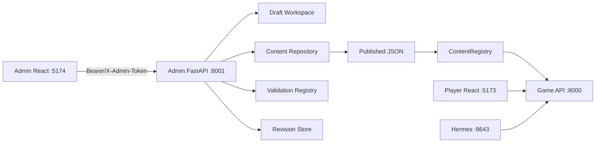

# Plan 022: Lord Tail 内容管理 Admin Portal

## 目标

为 Lord Tail 增加一个与玩家游戏界面、Hermes gateway 和游戏状态 API 相互隔离的图形化内容管理后台：

> **Lord Tail Admin Portal**

管理员可以在浏览器中新增、查看、修改、复制、停用、归档和安全删除以下内容：

- schema v2 预编剧情图（Story Arc）；
- schema v1 Storylet 事件；
- 预设人物模板；
- 人物 kind、组件模板与身体预设；
- 物品与装备；
- 身体部位、装备槽位、槽位别名和男女/通用身体槽位预设；
- 后续纳入统一内容仓库的建筑、兵种、资源、事件模板等内容。

Admin 第一版必须完成以下闭环：

```text
读取已发布内容
  -> 创建或复制草稿
  -> 图形化／表单编辑
  -> 实时字段校验
  -> 全局引用与路径校验
  -> 预览 diff 和影响范围
  -> 原子发布
  -> 后端内容注册表安全重载
  -> 记录版本与审计日志
  -> 可回滚到上一已发布版本
```

默认端口：

```text
玩家前端       http://127.0.0.1:5173
游戏 API       http://127.0.0.1:8000
Admin 前端     http://127.0.0.1:5174
Admin API      http://127.0.0.1:8001
Hermes Gateway http://127.0.0.1:8643
```

全部端口必须可以通过环境变量修改。Admin API 不挂载到游戏 API 的 `/api` 路由中，Hermes profile 不暴露 Admin tools。

## 核心原则

### 1. 内容定义与游戏存档严格分离

Admin 管理的是“以后实例化时使用的内容定义”，不是当前存档中的运行实例。

- Story Arc Definition 不等于当前 `storylets.chains`。
- Storylet Definition 不等于当前 `StoryEventInstance`。
- 预设人物模板不等于存档中的具体 NPC。
- 装备定义不等于某人物 inventory 中的物品实例。
- 身体预设不等于某人物已经冻结的 `body_profile`。

修改已发布定义不能偷偷追溯修改：

- 已激活剧情图的冻结 facts、cast、choice 和结果；
- 已生成 NPC 的身份、组件和装备；
- 已经写入存档的物品、人物与历史事实。

若以后需要修改当前游戏状态，继续使用现有玩家/Hermes 统一状态 API；不要从 Admin 内容编辑器直接写游戏存档。

### 2. 不直接编辑生产文件

浏览器编辑永远先写 Admin draft workspace。只有显式“发布”才允许改动版本库中的正式 JSON。

```text
编辑器状态
  -> draft 文件
  -> schema validation
  -> reference validation
  -> domain validation
  -> candidate snapshot
  -> atomic publish
```

不得在每次输入框 `onChange` 时直接改写：

```text
backend/app/data/catalog.json
backend/app/data/storylets/*.json
backend/app/data/characters/*.json
```

### 3. 删除必须引用安全

发布过的稳定 id 不允许直接重命名。重命名等价于：

1. 创建新 id；
2. 迁移所有定义引用；
3. 将旧 id 归档；
4. 确认没有存档、剧情实例或装备实例引用后再考虑硬删除。

删除请求必须先运行 impact analysis。被以下内容引用时只能停用/归档，不能硬删除：

- Story Arc transition、roles、effects 或 series；
- Storylet trigger、parameters、roles 或 effects；
- 预设人物的 kind、component、body preset、初始装备；
- 装备的 allowed/occupied slot、requirements 或效果目标；
- 身体预设与槽位别名；
- 当前存档和已有 save 文件中的 definition/item/slot/kind id。

### 4. 发布必须原子化

一次 publish 要么全部成功，要么正式文件、内容注册表和版本号都保持原样。

发布事务：

```text
取得 content publish lock
  -> 检查 draft base_revision / ETag
  -> 在内存中组成完整 candidate catalog
  -> 运行全部校验器
  -> 写入同目录临时文件并 fsync
  -> 保存 revision snapshot
  -> os.replace 正式文件
  -> reload ContentRegistry
  -> 运行 post-load smoke validation
  -> 写 audit entry
  -> 释放锁
```

任一步失败时回滚正式文件和运行时 registry；不能出现“一半剧情图已经发布、一半装备仍是旧版本”。

### 5. Admin 不依赖 Hermes

图编辑、校验、路径遍历、人物预览、装备合法性和发布全部由本地确定性代码完成。

可在后续版本增加“让书记官润色 fallback 文案”的可选按钮，但该功能只能返回候选文本并写入草稿，不能自动发布、创建 transition 或决定 effect。

## 当前问题与前置重构

现有内容位置并不统一：

| 内容 | 当前来源 | Admin 前置处理 |
| --- | --- | --- |
| Story Arc | `backend/app/data/storylets/*.json` schema v2 | 保留格式，接入统一 repository |
| Storylet | 同目录 schema v1 | 保留格式，接入统一 repository |
| 人物生成模板 | `character_generation.json`、`wardrobe_templates.json` | 保留全局生成配置，新增独立 preset character |
| 人物 kind | `systems/characters.py::CHARACTER_KINDS` | 抽取为 JSON |
| 人物 component 默认值 | `systems/characters.py::COMPONENT_DEFAULTS` | 抽取为 JSON + schema |
| STR/DEX 等属性 | `systems/characters.py::ATTRIBUTE_IDS` | 抽取为 JSON |
| 身体/装备槽位 | `EQUIPMENT_SLOT_REGISTRY` 等 Python 常量 | 抽取并拆分 anatomy/slot/preset 配置 |
| 装备 | `catalog.json.items` | 迁移到独立 `items.json`，保留兼容读取 |
| 建筑、兵种、资源 | `catalog.json` | 第一版只读展示，后续通过同一 adapter 开放编辑 |

第一阶段不能简单地从浏览器修改 Python 文件。应先建立数据驱动配置，然后让原有运行时代码从 registry 读取。

## 进程与端口架构



### Admin API 独立应用

新增：

```text
backend/app/admin_main.py
```

该应用只挂载：

```text
/admin-api/v1/*
/admin-health
```

游戏 `main.py` 不 include Admin router。这样即使 `/docs`、Hermes auto-approval 或游戏 CORS 配置出错，也不会意外获得内容写权限。

### Admin React 应用

新增独立项目：

```text
admin/
  package.json
  vite.config.ts
  src/
```

Admin 不复用玩家 `frontend/src/App.tsx`。可抽取通用 Markdown、表格和主题组件到独立 shared package，但不能让管理依赖侵入游戏 bundle。

### start.sh

扩展一键启动脚本：

```text
LORD_TAIL_ADMIN_ENABLED=1
LORD_TAIL_ADMIN_API_PORT=8001
LORD_TAIL_ADMIN_UI_PORT=5174
```

默认开发环境启动 Admin；可以通过 `LORD_TAIL_ADMIN_ENABLED=0` 禁用。脚本需要：

- 安装 `admin/node_modules`；
- 启动 Admin API 和 Vite；
- 在 cleanup 中只停止本次脚本启动的 Admin PID；
- 检测端口占用并给出明确错误；
- 输出 `http://127.0.0.1:5174`，不自动开放公网监听。

## 安全模型

第一版仅用于本机内容维护，但仍必须建立明确安全边界。

### 网络限制

- Admin API 和 UI 默认 bind `127.0.0.1`。
- Admin API CORS 只允许配置的 Admin UI origin。
- 禁止 `0.0.0.0` 和远程访问；如果未来需要远程管理，必须先重新引入正式身份系统和 HTTPS。

### 本机免登录

- Admin 不设置登录 token，前端打开后直接使用。
- Admin API 只接受 loopback 客户端，`start.sh` 强制绑定 `127.0.0.1`。
- Hermes 不获得 Admin tools，游戏 API 也不挂载 Admin router。
- 如果未来需要远程访问，必须先增加正式认证，不能只解除监听限制。

### 文件边界

Content Repository 使用白名单 content type 和 id 解析路径：

- 不接受客户端提交绝对路径；
- 不接受 `..`、斜杠、反斜杠或 URL 编码路径穿越；
- 文件名只由经过校验的稳定 id 生成；
- 只允许写入配置目录、draft workspace 和 revision store；
- 不允许 Admin API 执行 shell、Python 表达式或任意 JSON Patch。

### 审计

每次 create/update/archive/delete/publish/rollback 记录：

```json
{
  "id": "audit_000012",
  "time": "ISO-8601",
  "actor": "local-admin",
  "action": "publish",
  "content_type": "story_arc",
  "content_id": "spring_caravan_visit",
  "from_revision": "sha256:...",
  "to_revision": "sha256:...",
  "summary": "修改贸易听证分支",
  "changed_paths": ["nodes.trade_hearing.choices"],
  "result": "success"
}
```

审计日志只保存操作元数据，不保存任何 Hermes 或内部重载凭证。

## 统一 Content Repository

新增：

```text
backend/app/content/
  models.py
  registry.py
  repository.py
  adapters.py
  validation.py
  references.py
  revisions.py
  publish.py
```

### ContentType

第一版注册：

```text
story_arc
storylet
preset_character
character_kind
character_component
character_attribute
body_part
equipment_slot
body_slot_preset
item
```

预留只读类型：

```text
resource
building
unit
event_template
population_class
```

统一元数据：

```json
{
  "content_type": "item",
  "id": "iron_helmet",
  "schema_version": 1,
  "content_version": 3,
  "status": "published",
  "title": "铁盔",
  "tags": ["armor", "metal"],
  "source_file": "items.json",
  "revision": "sha256:...",
  "updated_at": "..."
}
```

这些元数据由 repository 返回，不强迫现有运行时 definition 全部内嵌相同 envelope。

### Adapter

每种内容使用 adapter 处理其现有落盘格式：

```python
class ContentAdapter(Protocol):
    def list_documents(self, snapshot) -> list[ContentDocument]: ...
    def get_document(self, snapshot, content_id) -> ContentDocument: ...
    def apply_candidate(self, snapshot, document) -> CandidateSnapshot: ...
    def remove_candidate(self, snapshot, content_id) -> CandidateSnapshot: ...
    def validate(self, candidate) -> list[ValidationIssue]: ...
```

例如：

- Story Arc adapter 管理单个 schema v2 JSON 文件；
- Storylet adapter 管理 schema v1 文件和其中的 node list；
- Item adapter 管理 `items.json` 中的 keyed object；
- Body slot adapter 管理 `character_schema.json` 中的注册表；
- Preset character adapter 管理一人物一文件。

Admin router 不应该知道文件路径和 JSON 内部存储细节。

## 建议的数据目录

新增或迁移为：

```text
backend/app/data/
  catalog.json                         # 现有经济/地图等内容，逐步拆分
  items.json                           # 装备与一般物品
  characters/
    registry.json                      # 属性、kind、component schema/defaults
    anatomy.json                       # 身体部位定义
    equipment_slots.json               # 装备槽、别名、身体预设
    presets/
      default_steward.json
      southern_caravan_master.json
  storylets/
    *.json
```

迁移期间 `catalog.py` 对外仍导出 `ITEMS` 等兼容对象，避免一次修改所有系统。

### ContentRegistry 热重载

当前许多模块执行：

```python
from app.catalog import ITEMS
```

第一版 registry reload 必须保持这些 dict 对象的身份稳定：

```python
ITEMS.clear()
ITEMS.update(candidate_items)
```

并清除：

- Storylet/Story Arc `lru_cache`；
- by-name 索引；
- character registry 派生 preset；
- Admin validation cache；
- public catalog snapshot。

中长期再把业务代码迁移为 `content_registry.items()`，不要在本 Plan 中强制重写全部模块。

## Draft、Revision 与发布模型

### Draft Workspace

默认目录：

```text
.content-admin/
  drafts/
  revisions/
  audit.jsonl
  publish.lock
```

`.content-admin/` 加入 `.gitignore`。正式内容 JSON 仍在 Git 管理中。

Draft schema：

```json
{
  "id": "draft_000001",
  "content_type": "story_arc",
  "content_id": "spring_caravan_visit",
  "operation": "update",
  "base_revision": "sha256:...",
  "document": {},
  "status": "editing",
  "validation": {"errors": [], "warnings": []},
  "created_at": "...",
  "updated_at": "..."
}
```

### Optimistic Concurrency

更新 draft 和 publish 都要求 `If-Match` 或请求体中的 revision：

- revision 一致：允许更新；
- revision 不一致：返回 `409 content_revision_conflict`；
- 响应同时给出 server revision 和客户端 draft diff；
- 不允许后到请求静默覆盖先到请求。

### Revision Store

每次成功 publish 保存受影响正式文件的不可变 snapshot 和 manifest：

```text
.content-admin/revisions/<revision_id>/
  manifest.json
  files/...
```

回滚也是一次新的 publish，不把 revision 指针偷偷倒退。回滚前必须重新运行当前代码版本的全部校验器。

## Admin API 设计

基础前缀：

```text
/admin-api/v1
```

### 健康和能力

```http
GET /admin-health
GET /admin-api/v1/meta
GET /admin-api/v1/content-types
GET /admin-api/v1/schemas/{content_type}
```

`content-types` 返回可编辑状态、schema、UI hints、id 规则和支持的 preview 能力。

### 内容读取

```http
GET /admin-api/v1/content/{content_type}?query=&status=&tag=&page=
GET /admin-api/v1/content/{content_type}/{content_id}
GET /admin-api/v1/content/{content_type}/{content_id}/references
GET /admin-api/v1/content/{content_type}/{content_id}/history
```

### Draft CRUD

```http
POST   /admin-api/v1/drafts
GET    /admin-api/v1/drafts
GET    /admin-api/v1/drafts/{draft_id}
PUT    /admin-api/v1/drafts/{draft_id}
DELETE /admin-api/v1/drafts/{draft_id}
POST   /admin-api/v1/drafts/{draft_id}/clone
```

创建请求：

```json
{
  "content_type": "story_arc",
  "content_id": "spring_caravan_visit",
  "operation": "update"
}
```

删除 draft 只删除未发布草稿，属于可恢复性较高操作；删除正式内容必须走 archive/delete proposal。

### 校验与预览

```http
POST /admin-api/v1/drafts/{draft_id}/validate
GET  /admin-api/v1/drafts/{draft_id}/diff
POST /admin-api/v1/drafts/{draft_id}/preview
POST /admin-api/v1/drafts/{draft_id}/simulate
```

统一 ValidationIssue：

```json
{
  "severity": "error",
  "code": "unknown_equipment_slot",
  "path": "allowed_slots[0]",
  "message": "未知装备槽位：horn",
  "reference": {"content_type": "equipment_slot", "id": "horn"},
  "suggestion": "先创建并发布槽位，或选择现有槽位"
}
```

### 发布、归档和删除

```http
POST /admin-api/v1/drafts/{draft_id}/publish
POST /admin-api/v1/content/{content_type}/{content_id}/archive
POST /admin-api/v1/content/{content_type}/{content_id}/restore
POST /admin-api/v1/content/{content_type}/{content_id}/delete-proposal
POST /admin-api/v1/content/{content_type}/{content_id}/delete
POST /admin-api/v1/revisions/{revision_id}/rollback
```

`delete-proposal` 只返回影响分析，不写状态。`delete` 必须提交 proposal token、expected revision 和明确确认文本；存在强引用或 live save 引用时返回 409，不提供 `force=true` 绕过。

### Reload 状态

```http
GET  /admin-api/v1/registry/status
POST /admin-api/v1/registry/reload
```

普通发布会自动 reload。手动 reload 只用于人工直接编辑 JSON 后重新加载，仍必须先校验；失败保持旧 registry snapshot。

## 剧情图可视化编辑器

使用 `@xyflow/react` 或等价受维护图编辑库实现。

### 左侧：节点工具箱

节点类型：

```text
choice
automatic
timed
terminal
```

拖入画布时创建唯一临时 node id，不自动生成 effects 或剧情事实。

### 中央：Graph Canvas

显示：

- entry node 标识；
- 节点 kind、title、blocking、scene type；
- choice edge 标签；
- conditional/fallback edge 区别；
- terminal 收束；
- 未连接、不可达和循环错误；
- 当前选择路径高亮。

连线规则：

- choice edge 必须绑定一个 choice id；
- automatic edge 可以带 condition，但必须有唯一 fallback；
- timed node 的 edge 与 choice 绑定；
- terminal 不允许出边；
- 删除 node 前展示所有入边/出边和引用。

### 右侧：Inspector

分组表单：

```text
基本信息
Markdown fallback
角色 slots
冻结 parameters
triggers
choices
effects
transition / conditions
interaction budget
series occurrence
```

choice/effect/condition 使用注册表驱动表单，不允许用户输入任意 Python 或未注册 op。

### 底部：验证与路径面板

显示：

- reachable node count；
- terminal nodes；
- path count；
- 每条路径 blocking decision 数；
- 最大自动步数；
- 未知内容引用；
- 终局是否 resolve 入口事件；
- series outcome 是否覆盖实际 departure fact；
- Hermes 关闭时是否存在本地 fallback。

支持点选一条路径逐幕预览，但 preview 不写当前游戏状态。

### JSON 高级模式

提供只编辑当前 draft 的 Monaco/CodeMirror JSON 模式：

- 表单和 JSON 双向同步；
- JSON parse 失败时保留编辑文本，不覆盖最后有效 draft；
- 发布前仍走同一套 schema/reference/domain 校验；
- 不允许从编辑器指定任意目标文件路径。

## Storylet 编辑器

Storylet schema v1 使用结构化表单，重点包括：

- `id`、`node_key`、title、category、source_kind；
- priority、weight、cooldown、blocking、scene_type；
- trigger builder；
- role/casting builder；
- parameter generator builder；
- Markdown fallback 预览；
- choice/effect builder；
- followup node 引用；
- dry-run 人物选角和参数预览。

编辑器必须明确提示 schema v1 与 schema v2 的区别：

- schema v1 适合单次 Storylet 或兼容 followup chain；
- 多幕分支事件应新建 schema v2 Story Arc；
- 不提供一键把任意 v1 chain 自动转换为 v2；转换需建立显式 draft 并人工确认全部边。

Storylet preview 调用现有 `instantiate_storylet(..., commit=False)` 的专用 Admin wrapper，不占用 id、不写人物、不写事件、不修改当前存档。

## 预设人物编辑器

### 预设人物与实际 NPC

新增 `PresetCharacterDefinition`，只作为：

- 新游戏固定人物；
- 某些 Story Arc 的固定 casting 候选；
- 调试、示例或势力关键人物模板。

不自动把全部 preset 注入现有存档。

建议 schema：

```json
{
  "schema_version": 1,
  "id": "southern_caravan_master",
  "name": "马提亚斯",
  "kind": "merchant",
  "gender": "男",
  "age": 43,
  "role": "南路商队首领",
  "description_md": "...",
  "body_preset_id": "male",
  "components": {
    "attributes": {"base": {"STR": 9, "DEX": 11, "CON": 10, "INT": 13, "WIS": 12, "CHA": 14}},
    "social_identity": {"class_id": "merchants"},
    "personality_axes": {"greed": 64, "boldness": 55}
  },
  "initial_inventory": [
    {"item_id": "merchant_coat", "quantity": 1}
  ],
  "initial_equipment": {"torso": "merchant_coat"},
  "tags": ["caravan", "southern_route"],
  "status": "active"
}
```

表单功能：

- 基本身份、成年校验和人物 kind；
- STR/DEX/CON/INT/WIS/CHA；
- component 分组编辑；
- 身体 preset 与可用槽位预览；
- 初始 inventory/equipment 拖放预览；
- 装备 requirements、双手/多槽占用冲突检查；
- Storylet role matcher 测试；
- JSON 实例化预览，但不写存档。

### 人物 kind 与 component

Admin 可维护 kind 由哪些 component 构成，但 component schema 的危险结构变更必须更严格：

- 删除 component 前检查 preset 和存档引用；
- 修改默认字段类型属于 breaking change，要求递增 schema version；
- 不允许通过 Admin 定义可执行 Python validator；
- component 字段使用有限 JSON Schema 子集；
- 业务语义 validator 仍由后端白名单注册。

## 身体部位与装备槽位编辑器

当前代码把“身体部位”和“装备槽位”混在 `EQUIPMENT_SLOT_REGISTRY`。Admin 重构时应明确拆开。

### BodyPartDefinition

```json
{
  "id": "left_hand",
  "label": "左手",
  "category": "limb",
  "side": "left",
  "pair_id": "right_hand",
  "parent_id": "left_arm",
  "adult_only": false,
  "sex_restriction": "any",
  "tags": ["hand", "grasping"]
}
```

身体部位包括解剖位置；`nipple_chain`、`accessory_1` 不是身体部位。

### EquipmentSlotDefinition

```json
{
  "id": "left_hand",
  "label": "左手",
  "body_part_id": "left_hand",
  "virtual": false,
  "adult_only": false,
  "examples": ["武器", "盾牌", "工具"],
  "aliases": ["off_hand"]
}
```

虚拟槽位示例：

```text
nipple_chain
accessory_1
accessory_2
```

### BodySlotPreset

保留并数据化：

```text
common
male
female
```

校验：

- pair_id 必须反向一致；
- parent_id 不得形成环；
- equipment slot 引用存在的 body part，除非 `virtual=true`；
- adult_only slot 不得进入未成年 preset；
- male/female preset 按定义包含相应私密部位；
- 删除 slot 前检查装备 allowed/occupied/requirements 和人物 preset；
- alias 全局唯一，且不能遮蔽正式 slot id。

## 物品与装备编辑器

统一 ItemDefinition 支持一般物品和装备。

表单字段：

```text
id / name / type / description
tags
allowed_slots
occupied_slots
requirements
armor / damage / weight / durability / warmth / value
character attribute effects
realm resource effects
adult_only
status / content_version
```

UI 行为：

- allowed slots 使用多选，不输入裸字符串；
- occupied slots 显示身体/虚拟槽位图；
- 多槽装备预览左右脚、双手、腰部+私密部位等覆盖；
- requirements 选择目标槽位和 item tag；
- 装备冲突模拟使用正式 `_validate_item_equip_target` 的无状态 wrapper；
- 属性效果只允许已注册 character attributes；
- 领地效果只允许正式 resource ids；
- 私密装备必须明确 `adult_only=true`；
- 删除 tag 前展示依赖该 tag 的装备 requirements。

发布后当前人物已有装备不被自动替换；若定义变化导致旧存档非法，publish 校验必须阻止 breaking change，或要求显式 migration plan。

## 全局引用图

新增 `ReferenceIndex`，构建：

```text
(content_type, id)
  -> incoming references
  -> outgoing references
```

至少解析：

- Story Arc node/choice/transition/effect/role/series；
- Storylet trigger/role/parameter/effect/followup；
- preset character kind/component/body preset/item；
- character kind -> component；
- item -> slot/tag/attribute/resource；
- equipment preset -> slot；
- save files -> definition/item/slot/kind（只读扫描）。

Admin 详情页显示“被谁使用”和“使用了谁”。发布 candidate 时重建受影响部分；测试中可强制全量重建并比较结果。

## 校验层级

每次 draft validation 依次执行：

1. JSON parse；
2. content type schema；
3. id/name/version 规则；
4. 单文档 domain validator；
5. 全局引用 validator；
6. 图可达性、DAG、terminal 和路径预算；
7. 人物/装备/身体兼容 validator；
8. 当前存档与 save compatibility；
9. candidate registry load smoke test。

结果区分：

```text
error    阻止发布
warning  允许发布但必须展开确认
info     仅提示影响或风格建议
```

发布接口不能接受客户端的 `ignore_errors=true`。

## Admin 前端页面

### 全局布局

```text
左侧导航
  内容总览
  剧情图
  Storylet
  预设人物
  人物类型与组件
  物品与装备
  身体部位与槽位
  草稿箱
  发布历史
  审计日志

顶部状态
  当前 registry revision
  未发布草稿数
  validation errors
  游戏 API / Admin API 状态
```

### 列表页

支持：

- 搜索 id、标题、tag；
- content status 筛选；
- schema/content version；
- 最近修改与 revision；
- 引用数量；
- 校验状态；
- 新增、复制、创建草稿、归档；
- 批量校验，但第一版不支持批量删除。

### 编辑页

固定区域：

- 未保存/未发布提示；
- autosave draft 状态；
- base revision 与冲突；
- schema/form/JSON 模式；
- Markdown preview；
- validation issues 可点击定位字段；
- diff；
- references；
- 发布摘要输入框。

浏览器刷新必须从 draft 恢复，不丢失编辑；但 token 关闭 tab 后清除。

### 可访问性与错误处理

- 图编辑器之外的所有功能可用键盘完成；
- 节点/边具有文本列表替代视图；
- 删除、归档和回滚需要确认对话框；
- 后端错误保留结构化 code/path，不只显示“Server Error”；
- 网络中断不把未确认 draft 标为已保存；
- publish 过程中禁用重复提交，并依赖后端幂等 key 防止双击。

## 发布对运行中游戏的影响

### 安全热重载

允许热重载：

- 新增未被使用的定义；
- 修改本地 fallback 文案；
- 新增装备/槽位/人物 preset；
- 不改变已有引用语义的兼容字段。

要求后端重启或 migration plan：

- 删除或重命名稳定 id；
- 改变 component 字段类型；
- 改变 active Story Arc 已实例化 choice/transition 语义；
- 修改已有装备 occupied slots 导致存档人物装备冲突；
- 修改身体 preset 并希望追溯应用到已有人物。

Admin 发布结果必须返回：

```json
{
  "published": true,
  "revision": "sha256:...",
  "registry_reloaded": true,
  "restart_required": false,
  "migration_required": false,
  "affected_content": [],
  "warnings": []
}
```

若 `restart_required=true`，Admin 只发布内容并显示提示，不自行杀死/重启游戏、Hermes 或前端进程。

## 实施阶段

### 阶段 1：内容注册表与配置抽取

1. 新建 `backend/app/content/`。
2. 抽取 attributes、character kinds、component defaults。
3. 拆分 body part、equipment slot、body preset。
4. 将 `catalog.json.items` 迁移到 `items.json`。
5. 新增 preset character schema 和目录。
6. 保持 `catalog.py`、`characters.py` 现有导出兼容。
7. 添加配置 parity 测试，证明迁移前后玩家初始状态、装备和人物 registry 一致。

### 阶段 2：只读 Admin API

1. 新建 `admin_main.py` 和 auth middleware。
2. 实现 content type/schema/list/detail/reference API。
3. 实现 ContentAdapter 和 ReferenceIndex。
4. 实现 registry status 和 validation summary。
5. 验证 Admin 路由没有出现在游戏 API OpenAPI 中。

### 阶段 3：Draft 与原子发布

1. 实现 draft workspace、ETag 和冲突处理。
2. 实现 validate/diff/preview。
3. 实现 publish lock、candidate snapshot、os.replace 和 rollback。
4. 实现 revision store 和 audit log。
5. 实现 archive/restore/delete proposal。
6. 对失败注入进行事务测试。

### 阶段 4：Admin React 基础框架

1. 创建 `admin/` React + TypeScript + Vite。
2. 添加免登录导航、列表、草稿、diff、validation UI。
3. 添加通用 JSON Schema form widgets、Markdown preview 和 JSON 高级模式。
4. 添加 autosave 和 revision conflict 处理。
5. 更新 `start.sh` 一键启动 Admin API/UI。

### 阶段 5：剧情内容编辑器

1. 实现 Story Arc graph canvas、inspector、choice edge 和路径查看器。
2. 接入 Plan 021 图校验器。
3. 实现 Storylet trigger/role/parameter/choice/effect 表单。
4. 实现 dry-run 与本地 fallback 预览。
5. 验证编辑器不会把 generic event option 硬编码到定义中。

### 阶段 6：人物、装备与身体编辑器

1. 实现 preset character editor。
2. 实现 kind/component schema editor。
3. 实现 anatomy/body slot/preset editor。
4. 实现 item/equipment editor 和装备冲突模拟。
5. 实现全局引用、删除影响和 save compatibility UI。

### 阶段 7：文档与回归

1. 编写 `.docs/Admin内容管理后台使用与扩展.md`。
2. 说明本地 token、端口、草稿、发布、回滚和 Git 工作流。
3. 说明如何增加新的 ContentType adapter 和编辑器 widget。
4. 增加后端全量测试、Admin 单元测试和 Playwright 关键流程测试。
5. 验证玩家前端、游戏 API、Hermes 和旧存档无回归。

## 文件修改范围

新增后端：

```text
backend/app/admin_main.py
backend/app/api/admin/
  auth.py
  content.py
  drafts.py
  publish.py
  revisions.py
backend/app/content/
  models.py
  registry.py
  repository.py
  adapters.py
  validation.py
  references.py
  revisions.py
  publish.py
backend/app/data/items.json
backend/app/data/characters/registry.json
backend/app/data/characters/anatomy.json
backend/app/data/characters/equipment_slots.json
backend/app/data/characters/presets/*.json
```

修改后端：

```text
backend/app/catalog.py
backend/app/systems/characters.py
backend/app/storylets/config.py
backend/app/storylets/graph.py
backend/app/main.py                         # 仅注册 registry，不挂 Admin router
backend/app/data/catalog.json
backend/requirements.txt
```

Admin 前端：

```text
admin/package.json
admin/vite.config.ts
admin/tsconfig*.json
admin/src/api.ts
admin/src/App.tsx
admin/src/styles.css
admin/src/pages/*
admin/src/editors/story-arc/*
admin/src/editors/storylet/*
admin/src/editors/characters/*
admin/src/editors/items/*
admin/src/editors/anatomy/*
admin/src/components/*
```

脚本与文档：

```text
start.sh
.env.example
.gitignore
tools/validate_content_registry.py
tools/export_admin_revision.py
.docs/Admin内容管理后台使用与扩展.md
```

测试：

```text
backend/tests/test_content_registry.py
backend/tests/test_content_migration_parity.py
backend/tests/test_admin_auth.py
backend/tests/test_admin_content_api.py
backend/tests/test_admin_drafts.py
backend/tests/test_admin_publish.py
backend/tests/test_admin_delete_references.py
backend/tests/test_admin_story_arc_preview.py
backend/tests/test_admin_character_presets.py
backend/tests/test_admin_items_slots.py
backend/tests/test_admin_save_compatibility.py
admin/src/**/*.test.tsx
admin/e2e/content-management.spec.ts
```

## 专项测试

### 配置迁移

- items 拆分前后所有 id、字段和效果一致。
- character kind/component/defaults 拆分前后一致。
- common/male/female 身体可用槽位一致。
- 现有男性/女性/通用人物装备测试不变。
- 旧存档加载后物品、装备和人物属性结果不变。

### Admin 安全

- 无 token、错误 token 返回 401。
- 游戏 API token 不能访问 Admin。
- Hermes key 不能访问 Admin。
- `../catalog.json`、URL 编码路径穿越和绝对路径均返回 422。
- Admin router 不出现在游戏 API OpenAPI。
- CORS 拒绝非 Admin origin。
- audit 不泄漏 token。

### Draft 与并发

- 新建、更新、复制、删除 draft。
- autosave 后刷新可恢复。
- 两个客户端从同一 revision 编辑，后发布者得到 409。
- JSON parse 失败不覆盖最后有效 draft。
- draft 删除不删除正式内容。

### 原子发布

- 合法候选发布后 registry revision 变化。
- schema、引用或 domain 校验失败时正式文件字节不变。
- 模拟第二个文件写入失败时第一个文件回滚。
- reload 失败时 registry 继续提供旧 snapshot。
- 双击 publish 只产生一个 revision。
- 回滚生成新 revision，并重新通过当前校验器。

### Story Arc

- UI 可创建 choice/automatic/timed/terminal。
- edge 对应 choice id。
- entry 不存在、环、不可达、无 terminal、超 blocking budget 均阻止发布。
- 删除被 transition 引用的 node 被阻止。
- path viewer 与 `analyze_graph()` 结果一致。
- 发布后的 arc 可由现有 runtime 从入口推进到 terminal。

### Storylet

- trigger/role/parameter/effect 只允许注册项。
- followup 指向不存在 node 时阻止发布。
- dry-run 不改人物、计划事件、id 计数和游戏 state。
- schema v1 不被错误保存为 schema v2。

### 人物

- preset 引用未知 kind/component/body preset/item 时失败。
- 未成年 preset 不能配置 adult-only slot/item。
- 初始装备多槽冲突时失败。
- preset preview 不写当前存档。
- 删除被 preset 引用的 kind/component 被阻止。

### 装备与身体

- item allowed/occupied slot 引用合法。
- 双手、成对鞋、乳链依赖和多槽贞操装置可以预览。
- alias 重复或遮蔽正式 id 时失败。
- body part parent/pair 环或不对称时失败。
- 删除在装备或 body preset 中使用的 slot 被阻止。
- 修改装备导致现有 save 装备冲突时发布被阻止并列出人物/save。

### 前端 E2E

至少覆盖：

1. 打开本机 Admin 并进入内容总览。
2. 复制 `spring_caravan_visit` 为新 draft。
3. 在图上增加 node、choice 和 edge。
4. 制造循环并看到阻止发布的定位错误。
5. 修复后发布并在列表看到新 revision。
6. 新增装备，选择 allowed/occupied slots 并发布。
7. 尝试删除被装备引用的 slot，看到引用阻止。
8. 回滚一次发布并确认 registry 恢复。

## 验证命令

```bash
cd /Users/ray/raylab/lord-tail

PYTHONPATH=backend backend/.venv/bin/python -m compileall -q backend tools
PYTHONPATH=backend backend/.venv/bin/python tools/validate_content_registry.py
PYTHONPATH=backend backend/.venv/bin/pytest -q backend/tests

npm --prefix frontend run build
npm --prefix admin run test
npm --prefix admin run build
npm --prefix admin run e2e

git diff --check
```

手工 smoke：

```bash
./start.sh

curl -fsS http://127.0.0.1:8001/admin-health
curl -fsS http://127.0.0.1:8001/admin-api/v1/content-types
```

浏览器：

```text
http://127.0.0.1:5174
```

## 完成判定

- Admin 前端和 Admin API 使用独立、可配置端口，并由 `start.sh` 一键启动。
- Admin API 仅本地监听、要求独立 token，且不暴露给游戏前端或 Hermes。
- Story Arc 可以通过图形界面完成 CRUD、路径校验、预览和原子发布。
- Storylet 可以通过结构化表单完成 CRUD 和 dry-run。
- 可以维护 preset characters、character kinds/components、items/equipment、body parts、equipment slots 和 body presets。
- Python 中当前硬编码的人物/槽位注册表已数据化，迁移前后运行结果一致。
- 内容修改先进入 draft；发布具有 ETag、引用检查、revision、审计和回滚。
- 被引用或存在 save 兼容风险的内容不能硬删除。
- 发布失败不会留下部分写入，运行中的游戏继续使用最后有效 registry。
- 修改已发布定义不会偷偷改写当前 Story Arc instance、NPC、装备实例或存档历史。
- 管理文档足以指导用户新增内容、校验、发布、回滚和扩展 ContentType。
- 后端全量测试、玩家前端构建、Admin 测试和 Admin 构建全部通过。

## 不要做的事

- 不要让 Admin 直接编辑当前游戏 state 或 save JSON。
- 不要把 Admin router 挂到游戏 API 并交给 Hermes auto-approve。
- 不要把无鉴权 Admin API 暴露到本机 loopback 之外。
- 不要从浏览器接收任意文件路径。
- 不要在输入框变化时直接覆盖正式配置文件。
- 不要提供 `force delete` 绕过引用和存档检查。
- 不要允许任意 Python、JavaScript、JSON Patch、eval 或 shell effect。
- 不要让 LLM 自动创建分支、效果或发布内容。
- 不要通过修改 definition 追溯改写已经实例化的事件或人物。
- 不要为了 Admin 一次性重写所有经济、军事和外交模块；使用兼容 adapter 渐进迁移。
- 不要将身体部位和虚拟装备槽位继续混为一个概念。
